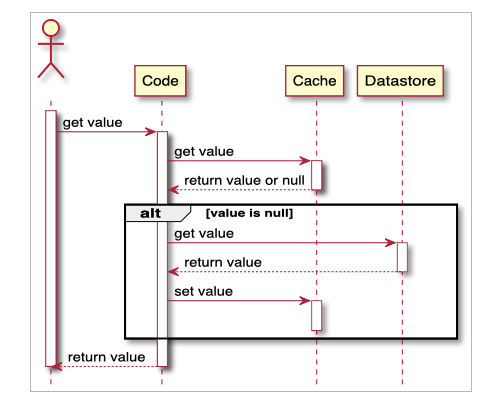

| CS-665       | Software Design & Patterns |
|--------------|----------------------------|
| Name         | SHIVANI ROY                |
| Date         | 05/03/2023                 |
| Course       | Spring                     |
| Assignment # | Final Project              |

# Assignment Overview
##### Master-Slave Database System and Caching
This project implements 'Cache-Aside' Caching, a widely used database management technique.

The requested data is checked if it is already present in the cache object.
If so, the data is retrieved from the cache and returned to the caller. Else, the data is fetched from the slave database,  which is a read-only database. If the data is still not present in the slave database, the application will then retrieve the data from the master database, which is the main database used for read-and-write operations.

This process of checking the cache first, followed by the slave database, and finally, the master database is known as a "fallback" or "cascading" mechanism. In this mechanism, the data is tried to retrieve from the least expensive data source first and only resorts to more expensive data sources if the data is not available elsewhere. This approach helps improve application performance by reducing the number of requests made to the master database, which can be slower due to the additional write operations it is responsible for.

This project uses a master-slave replication model, where one database server (the master) receives updates and modifications to the data while other servers (the slaves) replicate this data for read-only purposes.


### Implementation:

##### Master-Slave Database:
This implementation uses the observer pattern to keep the slave database up-to-date whenever there is a modification in the master database. Whenever an insert, update, or delete operation happens in the master database, the subject (the master database) notifies the observers (the slave database) of the change. The slave database then receives this notification and updates its state to reflect the changes made in the master database. This process ensures that the slave database stays synchronized with the master database.


##### Caching:


LRU caching (Least Recently Used caching)
- It is a caching technique used to manage data in a cache. A policy determines which items in a cache should be evicted when the cache is full and new items need to be added.
- In LRU caching, the least recently used items are evicted from the cache first, and the most recently used items are kept in the cache. When a new item needs to be added to the cache and the cache object is already full, the item that has been accessed the least recently is evicted to make room for the new item.
- LRU caching is based on the principle of temporal locality, which suggests that items accessed recently are more likely to be reaccessed in the near future than items that have not been accessed for a long time.

Cache-Aside:<div style="text-align:center">

    </div>
- In the cache-aside caching strategy, the application first checks if the data is present in the cache. If the data is not in the cache, the application retrieves it from the database and stores it in the cache. Subsequent requests for the same data can then be served from the cache, reducing the need for expensive database queries.
- If the data in the database changes, the application is responsible for invalidating the corresponding cache entry to ensure that stale data is not retrieved from the cache. This strategy is called "cache-aside" because the application manages the cache and the database separately.
- A cache invalidation technique is used to ensure that stale data is not retrieved from the cache. Cache invalidation involves removing the expired cache entries and fetching the latest data from the database when subsequent requests are made. This process ensures that the data served from the cache is always fresh and up-to-date.


# GitHub Repository Link:
https://github.com/shivroymet/cs-665-final-project.git

# Implementation Description 


For each assignment, please answer the following:

- LEVEL OF FLEXIBILITY:
  1. Code uses interfaces for the observer and publisher. In the future, if any update in the master needs to be notified to some other source, it can easily be added.
  2. Currently, we have two managers SlaveManager and MasterManager. If required, more managers can be added which can implement Manager.java and even extend DbManager.
  3. CountryCode is a model class used for storing objects in Database which extends TableObject. Similarly, Other Database Objects can be created by extending TableObject.
- SIMPLICITY and UNDERSTANDABILITY:
  1. The application is distributed in different packages. 
     1. model: Contains all model classes 
     2. dbconnection: Contains Connection and Database Manager packages. It also contains Observer and Publisher Classes. 
     3. dao: Contains DatabaseAccessObject class 
     4. cache: Contains Cache Store and TableObjectCache class which stores TableObject Cache
   2. Appropriate naming conventions for classes are used. In addition, whitespace and indentation make the code more readable.
   3. The code is properly documented using javadoc.
- REDUNDANCY and MAINTENANCE:
  1. The code uses Object-Oriented Programming concepts like Inheritance and Realization to avoid redundant code.
  2. DbManager is an abstract class that implements Manager. In this class, all the common code blocks have been included to avoid code redundancy in MasterManager and SlaveManager classes.
  3. The new classes of observers, publishers, and managers can easily be added and removed because of realization.
- DESIGN PATTERNS:
  1. Singleton Pattern: MasterConnection.java, SlaveConnection.java, SlaveObserver.java, SlavePublisher.java, CacheStore.java
     1. It allows creating a single instance of all the mentioned classes
  2. Observer Pattern: 
     1. When any insert, update, or delete operation happens in the master database, the observer pattern is used to automatically notify all the slave observers that a change has occurred. This is achieved by registering the SlaveObserver as observers with the SlavePublisher. Then, whenever a change occurs in Master DB, the MasterManager calls SlavePublisher to publish the change, which in turn notifies each of the registered observers, which in this case is the SlaveObserver, to notify them of the change.
     2. This enables a database architecture that uses a master-slave replication model, where one database server (the master) is responsible for receiving updates and modifications to the data, while other servers (the slaves) replicate this data for read-only purposes.
  3. Caching Pattern:
     1. It has a cache object (TableObjectCache) which has a map to store all cached objects which is managed by CacheStore.
     2. When data is requested, first check if it's present in the cache. If it's not present, fetch it from the data source and store it in the cache for future requests. 
     3. When data is updated in the data source, remove the corresponding data from the cache using the Cache-Aside policy so that it can be fetched from the data source again.


# Maven Commands

We'll use Apache Maven to compile and run this project. You'll need to install Apache Maven (https://maven.apache.org/) on your system. 

Apache Maven is a build automation tool and a project management tool for Java-based projects. Maven provides a standardized way to build, package, and deploy Java applications.

Maven uses a Project Object Model (POM) file to manage the build process and its dependencies. The POM file contains information about the project, such as its dependencies, the build configuration, and the plugins used for building and packaging the project.

Maven provides a centralized repository for storing and accessing dependencies, which makes it easier to manage the dependencies of a project. It also provides a standardized way to build and deploy projects, which helps to ensure that builds are consistent and repeatable.

Maven also integrates with other development tools, such as IDEs and continuous integration systems, making it easier to use as part of a development workflow.

Maven provides a large number of plugins for various tasks, such as compiling code, running tests, generating reports, and creating JAR files. This makes it a versatile tool that can be used for many different types of Java projects.

## Compile
Type on the command line: 

```bash
mvn clean compile
```


## JUnit Tests
JUnit is a popular testing framework for Java. JUnit test are automated tests that are written to verify that the behavior of a piece of code is as expected.

In JUnit, tests are written as methods within a test class. Each test method tests a specific aspect of the code and is annotated with the @Test annotation. JUnit provides a range of assertions that can be used to verify the behavior of the code being tested.

JUnit test are executed automatically and the results of the tests are reported. This allows developers to quickly and easily check if their code is working as expected, and make any necessary changes to fix any issues that are found.

The use of JUnit tests is an important part of Test-Driven Development (TDD), where tests are written before the code they are testing is written. This helps to ensure that the code is written in a way that is easily testable and that all required functionality is covered by tests.

JUnit tests can be run as part of a continuous integration pipeline, where tests are automatically run every time changes are made to the code. This helps to catch any issues as soon as they are introduced, reducing the need for manual testing and making it easier to ensure that the code is always in a releasable state.

To run, use the following command:
```bash
mvn clean test
```


## Spotbugs 

SpotBugs is a static code analysis tool for Java that detects potential bugs in your code. It is an open-source tool that can be used as a standalone application or integrated into development tools such as Eclipse, IntelliJ, and Gradle.

SpotBugs performs an analysis of the bytecode generated from your Java source code and reports on any potential problems or issues that it finds. This includes things like null pointer exceptions, resource leaks, misused collections, and other common bugs.

The tool uses data flow analysis to examine the behavior of the code and detect issues that might not be immediately obvious from just reading the source code. SpotBugs is able to identify a wide range of issues and can be customized to meet the needs of your specific project.

Using SpotBugs can help to improve the quality and reliability of your code by catching potential bugs early in the development process. This can save time and effort in the long run by reducing the need for debugging and fixing issues later in the development cycle. SpotBugs can also help to ensure that your code is secure by identifying potential security vulnerabilities.

Use the following command:

```bash
mvn spotbugs:gui 
```

For more info see 
https://spotbugs.readthedocs.io/en/latest/maven.html

SpotBugs https://spotbugs.github.io/ is the spiritual successor of FindBugs.


## Checkstyle 

Checkstyle is a development tool for checking Java source code against a set of coding standards. It is an open-source tool that can be integrated into various integrated development environments (IDEs), such as Eclipse and IntelliJ, as well as build tools like Maven and Gradle.

Checkstyle performs static code analysis, which means it examines the source code without executing it, and reports on any issues or violations of the coding standards defined in its configuration. This includes issues like code style, code indentation, naming conventions, code structure, and many others.

By using Checkstyle, developers can ensure that their code adheres to a consistent style and follows best practices, making it easier for other developers to read and maintain. It can also help to identify potential issues before the code is actually run, reducing the risk of runtime errors or unexpected behavior.

Checkstyle is highly configurable and can be customized to fit the needs of your team or organization. It supports a wide range of coding standards and can be integrated with other tools, such as code coverage and automated testing tools, to create a comprehensive and automated software development process.

The following command will generate a report in HTML format that you can open in a web browser. 

```bash
mvn checkstyle:checkstyle
```

The HTML page will be found at the following location:
`target/site/checkstyle.html`


